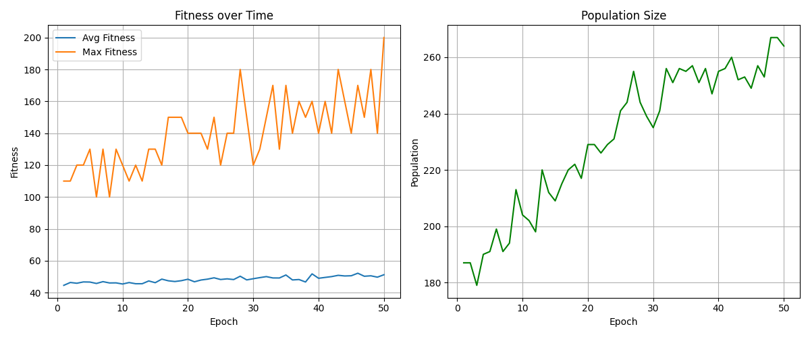
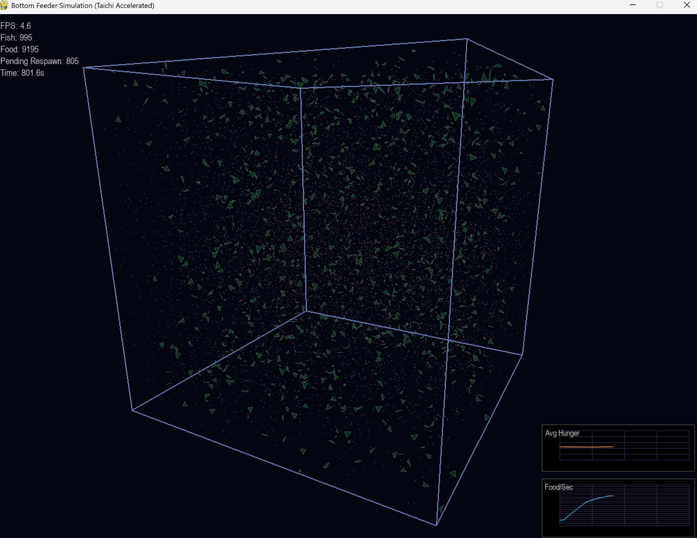
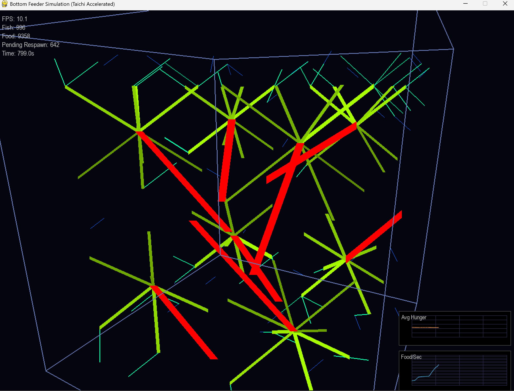

# 3D Bottom Feeder Simulation

A GPU-accelerated 3D neural network fish tank simulation where fish evolve to graze on thousands of food particles using field-of-view based density sensors. Built with **Taichi** for high-performance physics and **Pygame** for 3D rendering.

## Simulation Demo


## Training Progress



|  |  |  |
|:--------------------------------------:|:----------------------------------------:|:----------------------------------:|
|        **Normal Mode**                 |         **Density Mode**                 |        **Flow Mode**               |

> **What is this simulating?**  
> An ecosystem where fish must survive by efficiently grazing on a dense cloud of 10,000+ food particles. Each fish is controlled by a neural network that evolves through natural selection to optimize foraging behavior.


---

## 📋 Table of Contents

- [Overview](#overview)
- [Features](#features)
- [Installation](#installation)
- [Quick Start](#quick-start)
- [How It Works](#how-it-works)
  - [Simulation Architecture](#simulation-architecture)
  - [Neural Network](#neural-network)
  - [Physics & Sensing](#physics--sensing)
  - [Rendering Pipeline](#rendering-pipeline)
- [Visualization Modes](#visualization-modes)
- [Training System](#training-system)
- [File Structure](#file-structure)
- [Configuration](#configuration)
- [Controls](#controls)
- [Technical Details](#technical-details)

---

## Overview

This simulation models an ecosystem where fish must survive by grazing on a dense cloud of 10,000+ tiny food particles. Each fish is controlled by a neural network that processes sensory information about food density in its field of view. Through evolutionary training, fish learn to efficiently navigate and feed in this environment.

### What Makes This Unique?

- **GPU-Accelerated Physics**: Uses Taichi to handle collision detection and sensor calculations for thousands of entities at 60 FPS
- **Field-of-View Sensing**: Fish detect food density in 5 sectors within a 120° cone, mimicking realistic vision
- **Metabolic Simulation**: Hunger increases based on fish size and speed, creating survival pressure
- **Multiple Visualization Modes**: View the simulation as normal 3D graphics, density heatmaps, or velocity flow fields
- **Offline Training**: Train fish at maximum speed without rendering, then load trained models into the live simulation

---

## Features

### Core Simulation
- **10,000 Food Particles**: Tiny, low-nutrition droplets that respawn after being eaten
- **150 Fish**: Neural network-controlled agents with genetic variation
- **Dynamic Hunger**: Larger and faster fish get hungry more quickly
- **Reproduction**: Fish reproduce when they have sufficient energy
- **Evolution**: Genetic algorithms select and mutate successful fish

### Visualization
- **Normal Mode**: Fish as colored 3D triangles, food as white particles
- **Density Mode**: Volumetric gas-like heatmap showing food distribution
- **Flow Mode**: Fish rendered as velocity vectors showing movement patterns
- **Live Graphs**: Real-time hunger and consumption rate tracking
- **3D Camera**: Free-flying camera with mouse and keyboard controls

### Training
- **Headless Training**: Run simulation at maximum speed without rendering
- **Model Persistence**: Save and load trained neural networks
- **Training Logs**: JSON logs and PNG plots of fitness progression
- **Live Loading**: Load trained models into running simulation

---

## Installation

### Prerequisites
- Python 3.8+
- CUDA-capable GPU (recommended) or CPU fallback

### Dependencies

```bash
pip install taichi pygame numpy matplotlib
```

---

## Quick Start

### Run the Simulation

```bash
python bottom_feeder.py
```

### Train Fish Offline

```bash
python train_feeder_offline.py
```

This will run 50 epochs of training and save models to `trained_models/`.

### Load Trained Fish

1. Run `python bottom_feeder.py`
2. Press **L** to load the latest trained model
3. Watch the trained fish perform!

---

## How It Works

### Simulation Architecture

The simulation is built on a modular architecture with clear separation of concerns:

```
┌─────────────────┐
│  bottom_feeder  │  Main loop, input handling
└────────┬────────┘
         │
    ┌────▼────────────────────────────┐
    │     feeder_world.py             │
    │  Simulation State Management    │
    │  - Fish population              │
    │  - Food respawning              │
    │  - Reproduction logic           │
    └────┬────────────────────────────┘
         │
    ┌────▼────────────────────────────┐
    │   feeder_physics.py (Taichi)    │
    │  GPU-Accelerated Calculations   │
    │  - Sensor updates               │
    │  - Collision detection          │
    │  - Density grid computation     │
    └────┬────────────────────────────┘
         │
    ┌────▼────────────────────────────┐
    │    feeder_entities.py           │
    │  Fish & Food Classes            │
    │  - Neural network forward pass  │
    │  - Movement physics             │
    │  - Hunger/energy mechanics      │
    └─────────────────────────────────┘
```

### Neural Network

Each fish has a **feedforward neural network** with:

#### Inputs (13 total)
1. **5 Density Sensors**: Food density in FOV sectors (Far Left, Left, Center, Right, Far Right)
2. **Normalized Speed**: Current speed / max speed
3. **Normalized Hunger**: Current hunger / max hunger
4. **Normalized Size**: Current size / max size
5. **Normalized Energy**: Current energy / typical max
6. **Previous Yaw Rate**: Last frame's turning rate (horizontal)
7. **Previous Pitch Rate**: Last frame's turning rate (vertical)
8. **Bias**: Always 1.0

#### Hidden Layer
- 8 neurons with tanh activation

#### Outputs (3 total)
1. **Target Yaw Rate**: Desired horizontal turning speed (-1 to 1)
2. **Target Pitch Rate**: Desired vertical turning speed (-1 to 1)
3. **Target Speed**: Desired swimming speed (0 to 1)

#### Network Architecture

```
Input Layer (13)  →  Hidden Layer (8)  →  Output Layer (3)
                      [tanh activation]
```

The network weights are the fish's "genetics" and are:
- Initialized randomly for new fish
- Inherited with mutations during reproduction
- Evolved through selection pressure (fitness = food eaten)

### Physics & Sensing

#### Taichi Kernels

The simulation uses three main GPU kernels:

**1. `update_sensors()`**
- Iterates through all food particles for each fish
- Calculates angle between fish's forward vector and food direction
- Determines which FOV sector the food falls into
- Accumulates density values weighted by distance

```python
# Pseudocode
for each fish:
    for each food particle:
        if particle in sensor range:
            angle = acos(forward_vector · direction_to_food)
            if angle < FOV_half_angle:
                sector = map_angle_to_sector(angle)
                density = (SENSOR_RANGE - distance) / SENSOR_RANGE
                fish_sensors[fish_id][sector] += density
```

**2. `check_collisions()`**
- Checks if food particles are within fish eating radius
- Marks eaten food as inactive
- Increments fish eaten counter for fitness tracking

**3. `update_density_grid()`**
- Maps food positions to a 30×30×30 grid
- Counts food particles per cell
- Used for density visualization mode

#### Field of View (FOV)

Fish have a **120° forward-facing cone** divided into 5 sectors:

```
        Far Left  Left  Center  Right  Far Right
            ◢      ◢      ▲      ◣      ◣
             ◢      ◢     │     ◣      ◣
              ◢      ◢    │    ◣      ◣
               ◢──────◢───┼───◣──────◣
                   120° FOV Cone
                           │
                          FISH
```

This mimics realistic vision where fish can only see what's in front of them, creating more interesting foraging behavior.

#### Hunger Mechanics

Hunger increases each frame based on:

```python
hunger_rate = HUNGER_BASE_RATE + size * HUNGER_SIZE_FACTOR + speed * HUNGER_SPEED_FACTOR
```

- **Base Rate**: 0.5 per second
- **Size Factor**: 0.1 × size (larger fish need more food)
- **Speed Factor**: 0.02 × speed (faster swimming burns energy)

When hunger reaches 100, the fish dies.

### Rendering Pipeline

#### 3D Projection

The simulation uses a custom 3D camera with perspective projection:

1. **Camera Position**: Calculated from spherical coordinates (distance, angle_x, angle_y)
2. **View Transformation**: Convert world coordinates to camera space
3. **Perspective Division**: Project 3D points to 2D screen coordinates
4. **Depth Sorting**: Sort all drawable objects back-to-front for proper alpha blending

#### Fish Rendering

Each fish is rendered as a **3D triangle** pointing in its direction of travel:

```
         Nose (forward)
            ▲
           ╱ ╲
          ╱   ╲
         ╱     ╲
        ╱       ╲
       ╱─────────╲
    Left        Right
   (base)      (base)
```

**Triangle Construction**:
1. Calculate fish's forward, right, and up vectors from yaw/pitch
2. **Nose**: Position + forward × size × 1.2
3. **Left**: Position + (backward × 0.4 + right × 0.7) × size
4. **Right**: Position + (backward × 0.4 - right × 0.7) × size
5. Project all three points to screen space
6. Draw filled polygon with color based on neural network weights

**Color Encoding**:
Fish color is generated from their neural network weights using a hash function, so genetically similar fish have similar colors.

---

## Visualization Modes

Press **P** to cycle through three different visualization modes, each revealing different aspects of the simulation:

### Normal Mode (Default)

**What you see**: Standard 3D view with fish as colored triangles and food as white particles.

**Purpose**: Watch the simulation as it naturally appears, observing fish behavior and population dynamics.

**Visual Elements**:
- **Fish**: Rendered as 3D triangles pointing in their direction of travel
  - Triangle color is generated from neural network weights (genetics)
  - Genetically similar fish have similar colors
  - Size represents fish size (larger fish = larger triangles)
- **Food**: 10,000 white particles scattered throughout the world
  - Particles fade based on distance from camera
  - Eaten food disappears and respawns after 5 seconds
- **World Boundaries**: Wireframe box showing simulation limits
- **Live Graphs** (toggle with G):
  - Average hunger across all fish
  - Food consumption rate (smoothed)


**How Fish Rendering Works**:
Each fish is drawn as a 3D triangle constructed from three points:
1. **Nose**: Position + forward vector × size × 1.2
2. **Left Wing**: Position + (backward + right) × size × 0.7
3. **Right Wing**: Position + (backward - right) × size × 0.7

The triangle is projected to 2D screen space and drawn with depth-based fading.

---

### Density Mode

**What you see**: Volumetric gas-like heatmap showing food distribution in 3D space.

**Purpose**: Understand where food is concentrated and how fish create "paths" by eating.

**Visual Elements**:
- **Color Gradient**: Blue (sparse) → Cyan → Green → Yellow → Red (dense)
- **Smooth Clouds**: Overlapping semi-transparent spheres create a continuous gas-like appearance
- **No Fish**: Fish are hidden to focus on food distribution
- **No Individual Food**: Particles are aggregated into a density field


**How It Works**:
1. **Grid Mapping**: The world is divided into a 30×30×30 grid (27,000 cells)
2. **Food Counting**: Each food particle is mapped to its grid cell
3. **Density Calculation**: Count how many food particles are in each cell
4. **Visualization**:
   - Only cells with food are rendered
   - Each cell is drawn as a soft, multi-layered cloud
   - Cloud size and opacity scale with food density
   - Clouds overlap and blend to create smooth gradients
5. **Color Mapping**: 
   - Intensity = cell_count / max_count
   - Color transitions through spectrum based on intensity

**Performance**: Optimized to only process ~100-500 active cells instead of all 27,000.

**Use Cases**:
- Identify food clustering patterns
- See how fish "carve paths" through the food cloud
- Understand spatial distribution of resources
- Observe how food respawning affects density over time

---

### Flow Mode

**What you see**: Hierarchical tree structure showing fish movement flow from fine details to main trunks.

**Purpose**: Analyze collective movement patterns at multiple scales, from local details to global trends.

**Visual Elements**:
- **Hierarchical Branches**: Connected lines forming a tree-like structure
- **Color Gradient**: Blue (fine branches) → Cyan → Green → Yellow → Red (main trunks)
- **Line Thickness**: Thicker lines = more accumulated fish flow
- **Brightness**: Brighter = stronger flow relative to sibling branches
- **4 Hierarchical Levels**: From finest (16×16×16) to coarsest (2×2×2 = 4 main trunks)
- **No Individual Fish**: Fish are hidden to show aggregated patterns


**How It Works**:

1. **Multi-Scale Grid Hierarchy** (4 levels):
   - **Level 1** (16×16×16): Finest branches - minimum 2 fish required
   - **Level 2** (8×8×8): Medium branches - minimum 4 fish required
   - **Level 3** (4×4×4): Large branches - minimum 8 fish required
   - **Level 4** (2×2×2): Main trunks - minimum 15 fish required (4 total trunks)

2. **Velocity Accumulation**: For each grid level:
   - Map each fish to its grid cell
   - Calculate velocity vector (vx, vy, vz) from yaw, pitch, and speed
   - Accumulate velocities in each cell
   - Average the velocities: `avg_velocity = sum_velocities / fish_count`

3. **Temporal Smoothing** (larger branches move slower):
   - **Finest branches** (smooth = 0.1): Keep 10% old + 90% new → Very responsive
   - **Medium branches** (smooth = 0.3): Keep 30% old + 70% new → Moderate
   - **Large branches** (smooth = 0.6): Keep 60% old + 40% new → Slower
   - **Main trunks** (smooth = 0.85): Keep 85% old + 15% new → Very slow, stable
   - Empty cells decay over time to prevent ghost branches

4. **Hierarchical Connection**:
   - Fine branches connect to their parent cell in the next coarser level
   - Lines drawn from child cell center → parent cell center
   - Creates a true tree structure where branches merge into trunks
   - Main trunks (level 4) extend in their flow direction

5. **Relative Flow Strength**:
   - For each cell, find all sibling cells (cells with the same parent)
   - Calculate: `relative_strength = this_cell_count / max_sibling_count`
   - Adjust brightness: `40% to 100%` based on relative strength
   - **Bright branches** = dominant flow direction
   - **Dim branches** = weaker, secondary flow

6. **Rendering**:
   - Coarse levels (dark, thick) drawn first (background)
   - Fine levels (light, thin) drawn on top (foreground)
   - Line thickness increases with level and fish count
   - Color gradient shows hierarchy level
   - Brightness shows relative importance within siblings

**What It Means**:

- **Blue/Cyan branches**: Local, detailed movement patterns - update quickly
- **Green branches**: Regional aggregated flow - moderate stability
- **Yellow/Red trunks**: Overall directional trends - very stable

- **Bright lines**: Strong flow in that direction (many fish)
- **Dim lines**: Weak flow in that direction (fewer fish)

- **Thick lines**: High accumulated fish count
- **Thin lines**: Low accumulated fish count

**Use Cases**:
- Identify overall migration patterns (red/yellow trunks)
- See how local movements (blue branches) feed into global trends
- Compare flow strength between different regions
- Understand multi-scale collective behavior
- Observe how fish respond to food distribution at different scales

**Advantages**:
- **Multi-Scale Analysis**: See both details and big picture simultaneously
- **Clear Hierarchy**: Tree structure shows how local flows aggregate
- **Temporal Stability**: Larger branches move slowly, easier to track trends
- **Flow Strength**: Brightness immediately shows dominant vs. minor flows
- **No Clutter**: Aggregation reduces 150 fish to ~50-100 meaningful lines

---

### Switching Between Modes

Press **P** to cycle: Normal → Density → Flow → Normal

Each mode updates in real-time, so you can switch mid-simulation to analyze different aspects of the same moment.


---

## Training System

### Offline Training

The `train_feeder_offline.py` script runs a **genetic algorithm**:

#### Training Loop

```
For each epoch (1-50):
    1. Reset all fish (age=0, hunger=0, energy=20)
    2. Run simulation for 30 seconds
    3. Calculate fitness for each fish (fitness = food eaten)
    4. Select top 20% of fish as "survivors"
    5. Repopulate to 150 fish by cloning survivors with mutations
    6. Save best fish neural network to trained_models/
    7. Log statistics to training_logs/
```

#### Fitness Function

```python
fitness = total_food_eaten
```

Simple but effective: fish that eat more food survive and reproduce.

#### Mutation

When creating offspring:
```python
for each weight in neural_network:
    if random() < mutation_probability (0.05):
        weight += random_normal(0, mutation_strength=0.1)
```

#### Training Logs

Logs are saved as JSON with fields:
- `epoch`: Epoch number
- `avg_fitness`: Average food eaten across all fish
- `max_fitness`: Best fish's food count
- `population`: Number of surviving fish

Example plot:


### Loading Trained Models

In the live simulation:
1. Press **L**
2. Latest model from `trained_models/` is loaded
3. Population is replaced with 150 clones of the trained fish
4. Each clone has slight mutations for diversity

---

## File Structure

```
3D_Bottom_feeder/
│
├── bottom_feeder.py          # Main entry point, game loop
├── feeder_constants.py       # All simulation parameters
├── feeder_physics.py         # Taichi GPU kernels
├── feeder_entities.py        # Fish and Food classes
├── feeder_world.py           # Simulation state management
├── feeder_renderer.py        # 3D rendering and visualization
├── feeder_logger.py          # Training statistics logging
├── train_feeder_offline.py  # Headless training script
│
├── trained_models/           # Saved neural networks (.pkl)
├── training_logs/            # Training statistics (.json, .png)
│
└── Archieve/                 # Original simulation (reference)
    ├── neural_network.py     # Neural network implementation
    ├── utils.py              # Helper functions
    └── ...
```

### Key Files Explained

#### `bottom_feeder.py`
- Initializes Pygame and Taichi
- Main game loop (input → update → render)
- Handles keyboard/mouse input
- Manages visualization mode switching
- Collects statistics for graphs

#### `feeder_constants.py`
- All tunable parameters in one place
- World dimensions, fish counts, food settings
- Hunger rates, reproduction thresholds
- Camera settings, visualization modes

#### `feeder_physics.py`
- `@ti.data_oriented` class with Taichi fields
- GPU kernels for parallel computation
- Handles 10,000+ food × 150 fish interactions per frame

#### `feeder_entities.py`
- `FeederFish`: Position, velocity, neural network, hunger, energy
- `FeederFood`: Position, active state, respawn timer
- Fish update logic (neural network forward pass, movement)

#### `feeder_world.py`
- Manages fish and food populations
- Synchronizes Python data ↔ Taichi fields
- Handles reproduction and food respawning
- Save/load simulation state

#### `feeder_renderer.py`
- `Camera3D`: 3D perspective projection
- `draw_feeder_world()`: Main rendering dispatcher
- Mode-specific rendering functions
- Graph and HUD drawing

---

## Configuration

Edit `feeder_constants.py` to customize:

### World Settings
```python
WORLD_WIDTH = 2000
WORLD_HEIGHT = 2000
WORLD_DEPTH = 2000
```

### Population
```python
INITIAL_FISH_COUNT = 150
MAX_FOOD = 10000
```

### Fish Behavior
```python
HUNGER_BASE_RATE = 0.5      # Lower = fish survive longer
REPRO_MIN_ENERGY = 40.0     # Lower = easier reproduction
FOV_ANGLE = 120.0           # Degrees of vision
SENSOR_RANGE = 400.0        # How far fish can sense food
```

### Visualization
```python
DENSITY_GRID_RES = 30       # Higher = finer density grid (slower)
VIS_MODE_NORMAL = 0
VIS_MODE_DENSITY = 1
VIS_MODE_FLOW = 2
```

---

## Controls

### Camera
- **Mouse Drag**: Rotate camera view
- **W/A/S/D**: Move camera forward/left/back/right
- **Q/E**: Move camera down/up
- **R/F**: Zoom in/out
- **Shift**: Hold for faster camera movement

### Visualization
- **P**: Cycle visualization modes (Normal → Density → Flow)
- **G**: Toggle graphs on/off

### Simulation
- **F5**: Save current simulation state
- **F6**: Load latest saved state
- **L**: Load latest trained model
- **ESC**: Quit

---

## Technical Details

### Performance Optimizations

1. **Taichi GPU Kernels**: All physics runs on GPU in parallel
2. **Spatial Optimization**: Only active food particles are processed
3. **Surface Caching**: Rendered clouds are cached and reused
4. **Vectorized Projection**: NumPy arrays for batch food projection
5. **Depth Sorting**: Only visible objects are sorted

### Data Flow

```
Python (CPU)                    Taichi (GPU)
─────────────                   ────────────
FeederFish.x,y,z    ──sync→    fish_pos field
FeederFish.yaw,pitch ──sync→   fish_rot field
FeederFish.size     ──sync→    fish_size field

                    ──compute→  update_sensors()
                    ──compute→  check_collisions()

fish_sensors field  ←─read──   Python
fish_eaten_count    ←─read──   Python

FeederFish.update() uses sensor data
FeederFish.fitness += eaten_count
```

### Memory Usage

- **Taichi Fields**: ~50 MB (10k food + 500 max fish)
- **Pygame Surfaces**: ~10-20 MB (cached clouds)
- **Python Objects**: ~5 MB (fish/food instances)
- **Total**: ~65-75 MB

### Frame Budget (60 FPS = 16.67ms)

- Taichi kernels: ~2-3ms
- Python fish updates: ~3-4ms
- Rendering (Normal): ~6-8ms
- Rendering (Density): ~8-12ms
- Rendering (Flow): ~4-6ms

---

## Future Enhancements

- [ ] Implement spatial hashing for 100k+ food particles
- [ ] Add predator species
- [ ] Implement NEAT (NeuroEvolution of Augmenting Topologies)
- [ ] Multi-GPU support
- [ ] WebGL/Three.js web version
- [ ] VR support

---

## License

This project is licensed under the **Apache License 2.0**.

See the [LICENSE](LICENSE) file for the full license text, or visit [https://www.apache.org/licenses/LICENSE-2.0](https://www.apache.org/licenses/LICENSE-2.0) for details.


---

## Acknowledgments

- **Taichi**: GPU-accelerated computing framework
- **Pygame**: Graphics and input handling
- **NumPy**: Numerical computations
- **Matplotlib**: Training visualization

---

## Citation

If you use this code in your research, please cite:

```bibtex
@software{bottom_feeder_2024,
  title={3D Bottom Feeder Simulation},
  author={Jason Hoford},
  year={2025},
  url={https://github.com/yourusername/3d-bottom-feeder-simulation}
}
```

---

**Made with ❤️ and Taichi**
